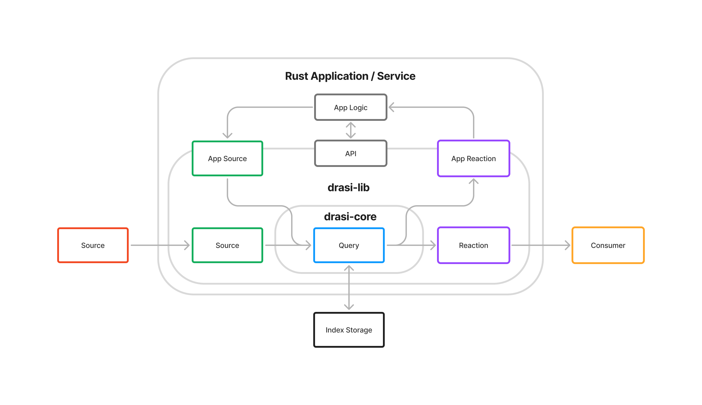

  <h1 class="hero-title">Build Change-driven Rust Solutions</h1>
  
drasi-lib is a Rust crate that brings Drasi's powerful change processing functionality directly into your application. Monitor data changes and react to them in real-time without external infrastructure.

  

    <a href="getting-started/" class="cta-button cta-button--primary">
      <i class="fas fa-rocket"></i>
      Get Started
    </a>
    <a href="/concepts/overview/" class="cta-button cta-button--secondary">
      <i class="fas fa-lightbulb"></i>
      Why Drasi?
    </a>
  

## How drasi-lib Works

Add drasi-lib to your Rust project, create Sources, Continuous Queries, and Reactions in code, and handle changes programmatically. Everything runs in-process with no external infrastructure.

  

    

      <i class="fas fa-box"></i>
    

    
Add Crate

    
Include drasi-lib in Cargo.toml

  

  

    <i class="fas fa-arrow-right"></i>
  

  

    

      <i class="fas fa-code"></i>
    

    
Write Code

    
Create Sources, Queries, and Reactions

  

  

    <i class="fas fa-arrow-right"></i>
  

  

    

      <i class="fas fa-bolt"></i>
    

    
Handle Changes

    
React to results in your code

  

Your application can ingest changes from external sources (like PostgreSQL or gRPC streams), from internal application state via App Sources, or both. Continuous queries process these changes and produce results that flow to Reactions—which can call external systems, update internal state via App Reactions, or both. The API layer gives your application direct access to query results and runtime control.

## When to Use drasi-lib

drasi-lib is ideal when you are developing a Rust application or service and need **efficient and precise change detection** without deploying separate infrastructure:

- **Event-driven microservices** — React to database changes without polling; get before/after states for every change
- **Real-time monitoring** — Trigger alerts when aggregations cross thresholds or conditions persist
- **In-app reactive logic** — Use application sources and reactions to drive and respond to state changes within your application, replacing complex event wiring with declarative queries
- **Edge and embedded systems** — Run change detection locally with minimal footprint
- **Custom data pipelines** — Embed reactive queries in ETL processes or stream processors

## Documentation Resources

The drasi-lib crate is published to crates.io with full API documentation available on docs.rs.

  <a href="https://github.com/drasi-project/drasi-core/blob/main/lib/README.md" target="_blank" rel="noopener">
    

      
<i class="fab fa-github"></i>

      

        <h3 class="unified-card-title">GitHub README</h3>
        
Source repository documentation with getting started guide and examples

      

    

  </a>
  <a href="https://crates.io/crates/drasi-lib" target="_blank" rel="noopener">
    

      
<i class="fas fa-box"></i>

      

        <h3 class="unified-card-title">crates.io</h3>
        
Package information, version history, and installation instructions

      

    

  </a>
  <a href="https://docs.rs/drasi-lib" target="_blank" rel="noopener">
    

      
<i class="fas fa-book"></i>

      

        <h3 class="unified-card-title">docs.rs</h3>
        
Complete API documentation, examples, and usage guides

      

    

  </a>

